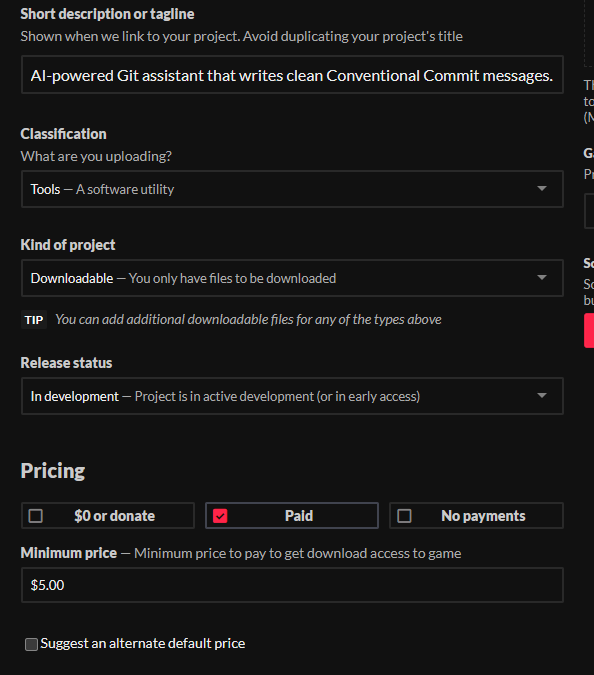

# AI Git Commit Generator

[](LICENSE)
[](pyproject.toml)
[](https://ollama.com/)
[](https://openrouter.ai/)

AI Git Commit Generator is a small CLI tool that writes clean Git commit messages for you.

It looks at your staged changes and handles the heavy lifting using either a **local LLM** (via Ollama) or a **free cloud API** (via OpenRouter). It automatically formats everything according to the **Conventional Commits** standard:

```text
feat: add command line options
fix: handle empty staged diff
docs: improve installation guide
```

The main idea is simple: instead of writing vague commits like `update`, `changes`, or `fix`, you get a useful message based on what actually changed in your code.

## Features

- Inspects your current `git diff --cached`.
- **Hybrid Architecture**: Works locally via Ollama or in the cloud using OpenRouter.
- **Zero-Config Cloud Mode**: Supports free cloud models (like Llama 3) so you don't need a powerful GPU or local installations.
- **Interactive Mode**: If run without the `--commit` flag, it provides an interactive menu to commit, edit, regenerate, or cancel.
- **CLI Aesthetics**: Rich, modern ANSI color terminal outputs (automatically falls back to plain text if not in a TTY).
- Follows the **Conventional Commits** standard (lowercase type, imperative mood).
- Can either print a suggested commit message or create the commit for you.
- Supports custom Ollama models.

## When To Use It

Use this tool after you have changed files in any Git project and want to make a commit.

For example, if you edited a Python script, fixed a bug, updated a README, or added a new feature, this tool can read those staged changes and suggest a commit message that describes them.

You do not need to run it from this repository. Run it from the project where you are making a commit.

## Prerequisites

To use the tool, you need one of the following setups:

### Option A: Cloud Mode (Easiest, no AI installation required)
- A free account on [OpenRouter](https://openrouter.ai/).
- A generated API key.
- Python and Git installed.

### Option B: Local Mode
- Installed [Ollama](https://ollama.com/).
- Downloaded local model, for example: `ollama pull qwen2.5`
- Python and Git installed.

## Installation

Clone this repository:

```bash
git clone https://github.com/XBarni999/ai-git-commit-generator.git
```

Go into the tool folder:

```bash
cd ai-git-commit-generator
```

Install the tool globally in editable mode:

```bash
python -m pip install -e .
```

After installation, the `ai-commit` command becomes available globally across your system.

## Basic Usage

Go to any Git project where you made changes:

```bash
cd path/to/your/project
```

Stage your changes:

```bash
git add .
```

### Running with Free Cloud API (No Ollama needed)

Set your OpenRouter API key in your terminal and run the tool:

**Windows (CMD):**
```cmd
set OPENROUTER_API_KEY=your_sk_or_v1_key_here
ai-commit
```

**PowerShell:**
```powershell
$env:OPENROUTER_API_KEY="your_sk_or_v1_key_here"
ai-commit
```

**Bash / Linux / macOS:**
```bash
export OPENROUTER_API_KEY="your_sk_or_v1_key_here"
ai-commit
```

### Running Locally (Via Ollama)

If no API key is found in your environment variables, the tool automatically falls back to your local Ollama instance:

```bash
ai-commit
```

Make sure your Ollama server is running (`ollama serve`).

## Interactive Mode

If you run the tool without the `--commit` flag in an interactive terminal, it will recommend a commit message and present you with options:

```text
Recommended commit message:
----------------------------------------
feat: add user authentication
----------------------------------------
Commit with this message? [y]es / [n]o / [e]dit / [r]egenerate:
```

- **`y` / `yes` / `[Enter]`**: Apply the recommended message and commit.
- **`n` / `no`**: Decline and exit without committing.
- **`e` / `edit`**: Prompt to enter a custom commit message instead.
- **`r` / `regenerate`**: Query the AI again to generate a new suggestion.

## Auto Commit Mode

If you want the tool to generate the message and immediately create the commit (skipping interactive checks), use the `--commit` flag:

```bash
git add .
ai-commit --commit
```

## CLI Options

- `help`: Custom command guide (also supports `-h` / `--help`).
- `--model`: Custom Ollama model name (Default: `qwen2.5`).
- `--url`: Custom Ollama endpoint (Default: `http://localhost:11434/api/generate`).
- `--timeout`: Request timeout in seconds (Default: `90`).
- `--commit`: Automatically create a git commit with the generated message.
- `--status`: Check Pro status and configuration settings.
- `--register <key>`: Register a Pro license key to unlock Pro features.
- `--review`: [PRO] Generate a comprehensive AI code review of staged changes.
- `--pr`: [PRO] Generate a detailed Pull Request description template.
- `--setup-gitmoji <on/off>`: [PRO] Toggle Gitmoji commit prefix formatting.
- `--setup-jira <on/off>`: [PRO] Toggle automatic Jira ticket matching from branch names.
- `--jira-codes <prefixes>`: [PRO] Configure custom comma-separated Jira issue prefixes.

## ★ Pro Features (Premium Upgrade)

Unlock advanced developer utilities by upgrading to the Pro version.

### 1. AI Code Review
Run code quality audits and security checks directly from your command line:
```bash
ai-commit --review
```

### 2. PR Description Generator
Auto-generate beautifully structured markdown descriptions for your pull requests:
```bash
ai-commit --pr
```

### 3. Smart Integrations (Jira & Gitmoji)
Configure ticket parsing and Gitmoji styles globally:
```bash
ai-commit --setup-gitmoji on
ai-commit --setup-jira on
ai-commit --jira-codes "PROJ,TASK,BUG"
```
Once enabled, commits are automatically structured using conventional formatting, Jira issues extracted from branch names (e.g. `feature/PROJ-123-billing` becomes `[PROJ-123]`), and Gitmojis prepended!

## Example Output

```text
Analyzing staged git changes...
Using OpenRouter Free Cloud API (Llama 3)...

Recommended commit message:
----------------------------------------
feat: add command line options
----------------------------------------
```

## Troubleshooting

### It says there are no staged changes
The tool only reads staged changes from `git diff --cached`. Make sure you run `git add .` first.

### It cannot connect to Ollama (Local Mode)
Make sure Ollama is running (`ollama serve`) and you have pulled the default model (`ollama pull qwen2.5`). Alternatively, set the `OPENROUTER_API_KEY` variable to use the cloud mode instead.

### It generated a bad message
Run it again, or try switching your backend or local model using the `--model` option. Or choose `r` (regenerate) in interactive mode.

## Why This Is Useful

Good commit messages make your project history easier to understand. They help you remember what changed, make pull requests clearer, and make open-source repositories look more professional. This tool saves time by turning your actual code changes into a readable commit message automatically.

## Privacy

- **Local Mode**: Your staged diffs stay entirely on your local machine and are processed by Ollama.
- **Cloud Mode**: Diffs are processed securely through OpenRouter's API using open-weights models.

## License

MIT
